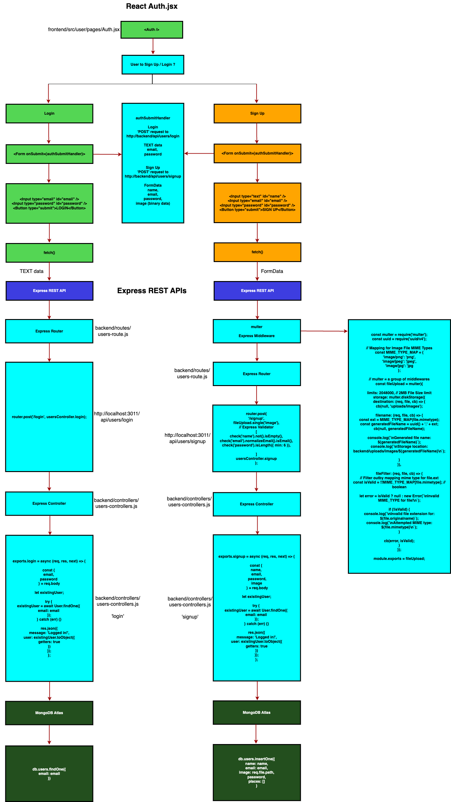
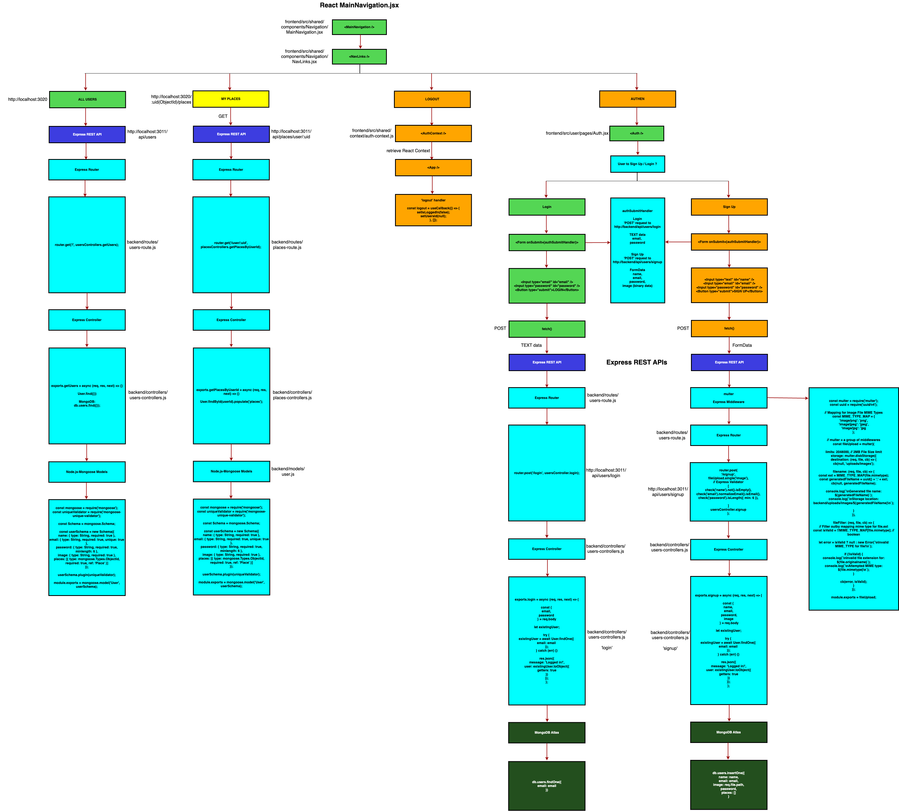

<h2>Little MERN project</h2>
<br/>

<br/>
<h2>Start playing with this MERN app</h2>
<h2>git clone https://github.com/PhoenixYork166/Little-MERN-practice-prod.git</h2>
<br/>
<h2>Open up with 2 terminals</h2>

```bash
cd frontend;
npm install;
npm start;
```

```bash
cd backend;
npm install;
npm start;
```

<h2>Users can upload their profile pic during 'Sign Up'</h2>
<br/>
<h2>Data-flow illustrations for React <Auth /> 'Sign Up' vs 'Login'</h2>
<h2>Frontend React -> Backend Node/Express REST API data-flow</h2>
<h2>Backend Express REST API -> MongoDB Atlas data-flow</h2>

<br/>

<h2>Data-flow illustrations for React <MainNavigation><NavLinks /></MainNavigation></h2>

<br/>